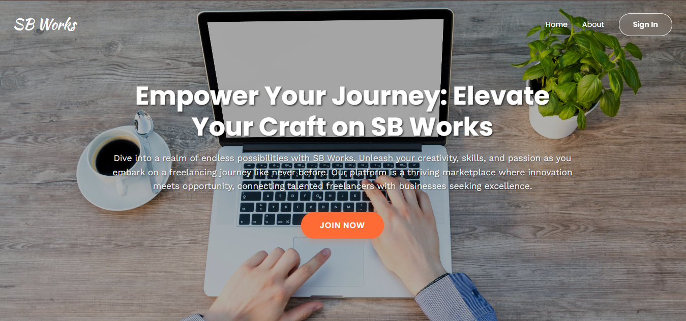

# 💼 Freelancing Application – MERN Stack

<div align="center">


### 🚀 Full-Stack Freelancing Platform Built with the MERN Stack

*A modern web application connecting clients and freelancers through secure job posting and application workflows.*

</div>

---

# 📌 Overview

The **Freelancing Application – MERN Stack** is a full-stack web platform developed to simulate real-world freelancing ecosystems where clients can post projects and freelancers can browse, apply, and manage opportunities efficiently.

This project demonstrates the implementation of:

- Full-stack MERN architecture
- Authentication & authorization
- RESTful API integration
- Role-based user access
- Real-world job workflow systems

The application focuses on scalability, modular backend design, and responsive user interaction.

---

# ✨ Core Features

## 👤 Authentication System

- Secure User Registration & Login
- JWT-based Authentication
- Session Management
- Protected Routes

---

## 🧑‍💼 Client Features

- Post Freelancing Jobs
- Manage Job Listings
- View Freelancer Applications
- Role-Based Dashboard Access

---

## 👨‍💻 Freelancer Features

- Browse Available Jobs
- Apply to Freelancing Opportunities
- View Application Status
- Personalized Dashboard

---

## 🔒 Security Features

- JWT Authentication
- Password Encryption
- Secure REST APIs
- Role-Based Authorization

---

# 🧠 Tech Stack

| Technology | Purpose |
|------------|---------|
| React.js | Frontend UI |
| Node.js | Backend Runtime |
| Express.js | Server Framework |
| MongoDB | Database |
| JWT | Authentication |
| CSS / Bootstrap | Styling |

---

# 🏗️ Project Structure

```bash
freelancing-application-mern/
│
├── client/
│   ├── public/
│   ├── src/
│   └── package.json
│
├── server/
│   ├── routes/
│   ├── controllers/
│   ├── models/
│   ├── middleware/
│   └── package.json
│
├── screenshots/
├── README.md
└── .gitignore
```

---

# ⚙️ Installation & Setup

## 1️⃣ Clone the Repository

```bash
git clone https://github.com/your-username/freelancing-application-mern.git
cd freelancing-application-mern
```

---

# 🚀 Backend Setup

## Navigate to Server Folder

```bash
cd server
```

## Install Dependencies

```bash
npm install
```

## Start Backend Server

```bash
npm start
```

---

# 🎨 Frontend Setup

## Navigate to Client Folder

```bash
cd client
```

## Install Dependencies

```bash
npm install
```

## Start Frontend Application

```bash
npm start
```

---

# 🔗 API Functionalities

- User Authentication APIs
- Job Posting APIs
- Job Application APIs
- Protected User Routes
- Role-Based Access APIs

---

# 📸 Screenshots

## 🏠 Homepage

<div align="center">



</div>

---

---

# 🎥 Demo Video

## ▶️ Project Demonstration

[Watch Demo Video](https://docs.google.com/videos/d/1nHiBkeNDCgShMW7T7Ee-BHdmt82NeZFXMay_8VJcaF0/play)

---

# 📈 Learning Outcomes

This project helped in understanding:

- MERN Stack Development
- REST API Integration
- Authentication Systems
- Database Design with MongoDB
- Full-Stack Application Architecture
- Frontend & Backend Communication

---

# 🛠️ Future Enhancements

- 💳 Payment Gateway Integration
- 📩 Real-Time Chat System
- ⭐ Ratings & Reviews
- 📄 Resume Upload System
- 🔔 Notification System
- ☁️ Cloud Deployment
- 📱 Mobile Responsive Optimization

---

# 👨‍🏫 Guided Project Details

| Field | Details |
|------|---------|
| **Project** | Freelancing Application (MERN) |
| **Duration** | 30 Days |
| **Mentor** | Syed |

---

# 🤝 Contributing

Contributions are welcome!

## Contribution Steps

1. Fork the Repository
2. Create a Feature Branch
3. Commit Changes
4. Push to Branch
5. Open Pull Request

```bash
git checkout -b feature-name
```

---

# 📜 License

This project is developed for educational and learning purposes.

---

# 👨‍💻 Developer

## Shubham Salunke

### 🚀 Full Stack & AI Developer

- Passionate about scalable web applications
- Focused on MERN stack development
- Building impactful real-world solutions

---


<div align="center">

## 💼 Connecting Talent with Opportunity Through Technology

Made with ❤️ using the MERN Stack

</div>
